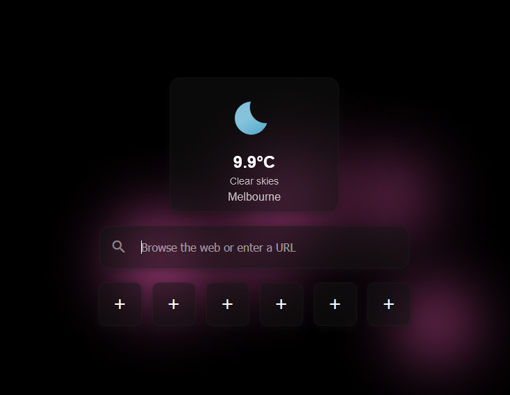

# Dark Glassmorphism Startpage

A sleek and modern startpage designed with a dark glassmorphism style. This startpage includes a Google search bar, six customizable shortcuts, a weather widget that automatically detects your location, and a customizable background.

## Features

- **Google Search Bar**: Quickly search the web using Google.
- **Customizable Shortcuts**: Easily access your favorite websites.
- **Weather Widget**: Automatically fetches and displays the current weather based on your location.
- **Customizable Background**: Personalize your startpage.
- **3D Tilt Effect**: A stylish 3D tilt effect on the weather card.
- **Shortcut Rows Configuration**: Customize the number of shortcut rows (1-3) displayed on the startpage through the settings.
- **Changeable City**: Update the city displayed in the weather widget via the settings.

## Shortcut Renaming

You can rename a shortcut by using `Shift + Left Click` on the shortcut you wish to rename.

## Dark Mode

The design embraces a clean and customizable dark mode, ensuring a comfortable browsing experience in low-light environments.

## SVG Icons

The weather widget utilizes SVG icons from the [Weather Icons](https://github.com/basmilius/weather-icons) library by Basmilius. These icons provide a visually consistent and clean representation of weather conditions.

## License

This project is licensed under the MIT License. See the [LICENSE](LICENSE) file for more details.
