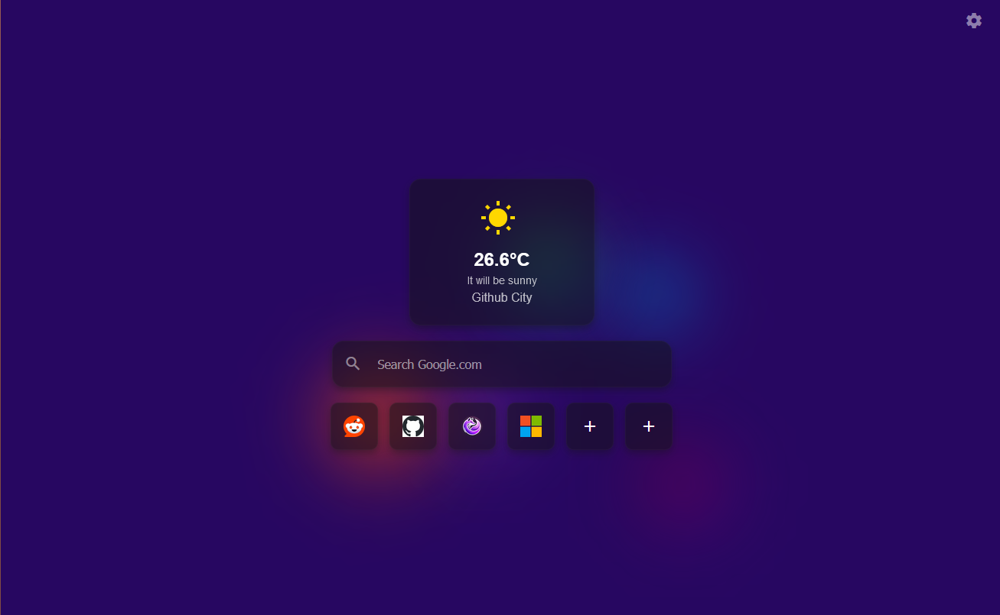
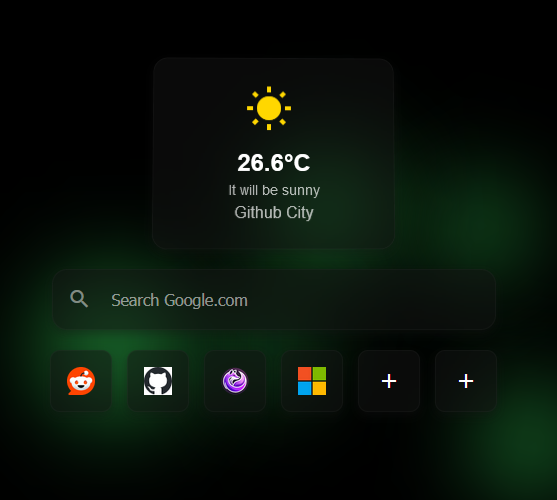

# Dark Glassmorphism Startpage

A sleek and modern startpage designed with a dark glassmorphism style. This startpage includes a Google search bar, six customizable shortcuts, a weather widget that automatically detects your location, and a customizable background.

## Features

- **Google Search Bar**: Quickly search the web using Google's powerful search engine.
- **Customizable Shortcuts**: Easily access your favorite websites with six slots for personalized shortcuts.
- **Weather Widget**: Automatically fetches and displays the current weather based on your location.
- **Customizable Background**: Personalize your startpage with a background image of your choice.

## Dark Mode

The design embraces a clean and customizable dark mode, ensuring a comfortable browsing experience in low-light environments.

## License

This project is licensed under the MIT License. See the [LICENSE](LICENSE) file for more details.
